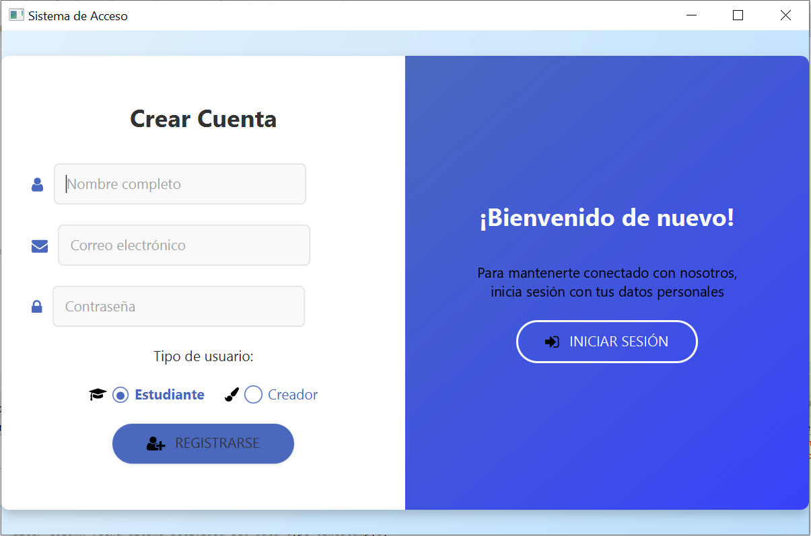
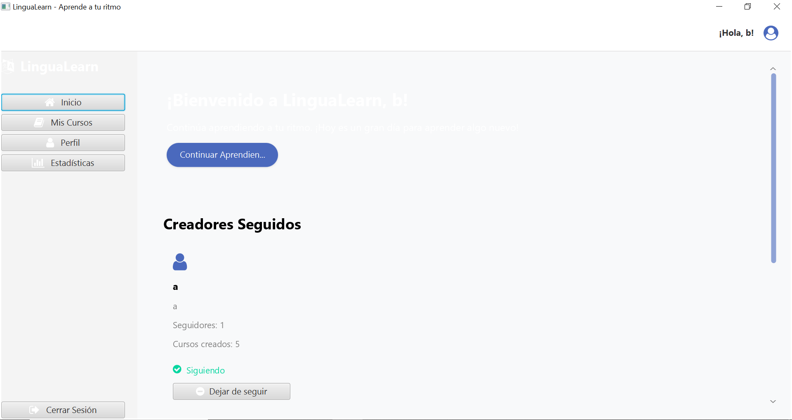

# 📚 Manual de Usuario - Aplicación de Aprendizaje (inspirada en Duolingo)

## 📝 Índice
1. [Introducción](#introducción)  
2. [Registro de Usuario](#registro-de-usuario)  
3. [Inicio de Sesión](#inicio-de-sesión)  
4. [Pantalla Principal](#pantalla-principal)  
5. [Realización de un Curso](#realización-de-un-curso)  
6. [Tipos de Preguntas](#tipos-de-preguntas)  
7. [Guardado y Reanudación](#guardado-y-reanudación)  
8. [Estadísticas](#estadísticas)  
9. [Gestión de Cursos](#gestión-de-cursos)  
10. [Funcionalidad Adicional](#funcionalidad-adicional)  

---

## ✨ Introducción

Esta aplicación permite a los usuarios **aprender y repasar conceptos** en distintos dominios (idiomas, programación, teoría musical, etc.) mediante cursos interactivos que combinan preguntas y tarjetas de aprendizaje.

Inspirada en **Duolingo** y **Mochi**, la plataforma busca ser **flexible y extensible**, permitiendo la incorporación de nuevos tipos de preguntas y contenidos creados por la comunidad.

---

## 👤 Registro de Usuario

Al iniciar la aplicación, encontrarás la opción de **crear una cuenta nueva**.  
1. Completa tu **nombre de usuario**, **correo electrónico** y **contraseña**.  
2. Haz clic en **Registrar**.  
3. Si los datos son válidos, se creará tu cuenta y podrás acceder a la aplicación.



---

## 🔑 Inicio de Sesión

Si ya tienes una cuenta:  
1. Introduce tu **usuario o correo electrónico** y tu **contraseña**.  
2. Haz clic en **Iniciar Sesión**.

En caso de error, verifica tus credenciales o usa la opción de recuperación de contraseña.


---

## 🏠 Pantalla Principal

Tras iniciar sesión, accederás a la **pantalla principal** donde podrás:  
- Seleccionar un curso existente.  
- Crear un curso nuevo (mediante carga de archivo JSON/YAML).  
- Consultar tus estadísticas.  
- Ver tu progreso y racha.



---

## 🎓 Realización de un Curso

Al elegir un curso, podrás seleccionar la **estrategia de aprendizaje**:  
- Secuencial.  
- Aleatoria.  
- Repetición espaciada.

Cada curso presentará las preguntas de acuerdo con la estrategia elegida.

---

## ❓ Tipos de Preguntas

Actualmente la aplicación incluye al menos **3 tipos de preguntas**:  
1. **Test de opción múltiple**: Selecciona la respuesta correcta.  
2. **Completar huecos**: Escribe la palabra o frase faltante.  
3. **Traducción**: Traduce una frase al idioma objetivo.

Es posible añadir nuevos tipos de preguntas de forma modular.

  


---

## 💾 Guardado y Reanudación

Puedes **guardar tu progreso** en cualquier momento y reanudarlo posteriormente:  
- La aplicación registra tu última pregunta respondida.  
- Al volver al curso, puedes continuar desde donde lo dejaste.

---

## 📊 Estadísticas

La aplicación lleva un seguimiento de tu rendimiento, incluyendo:  
- Tiempo total de uso.  
- Mejor racha (días consecutivos de uso).  
- Número de preguntas correctas/incorrectas por curso.

Puedes visualizar estas estadísticas desde la pantalla principal.

---

## 📂 Gestión de Cursos

La plataforma permite:  
- **Crear cursos personalizados** mediante archivos **JSON o YAML**.  
- **Importar cursos** a tu biblioteca interna.  
- Compartir tus cursos exportando el archivo y enviándolo a otros usuarios.

Ejemplo de archivo de curso:

```json
{
  "nombre": "Curso de Italiano Básico",
  "preguntas": [
    {"tipo": "test", "pregunta": "¿Cómo se dice 'hola'?", "opciones": ["Ciao", "Hola", "Hello"], "respuesta": "Ciao"},
    {"tipo": "traduccion", "pregunta": "Traduce: Good morning", "respuesta": "Buongiorno"}
  ]
}
